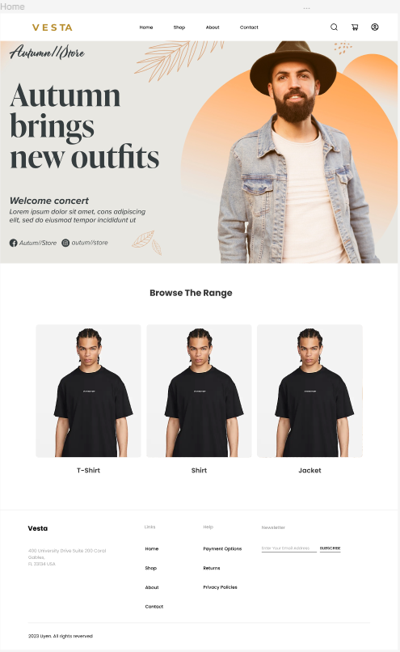
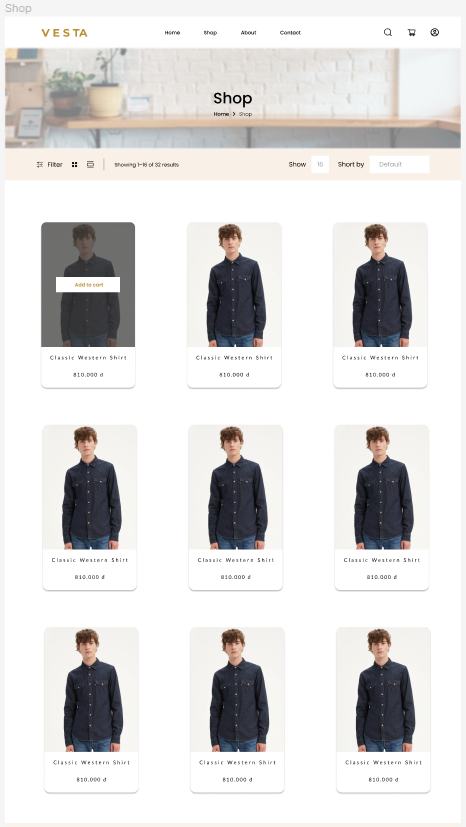
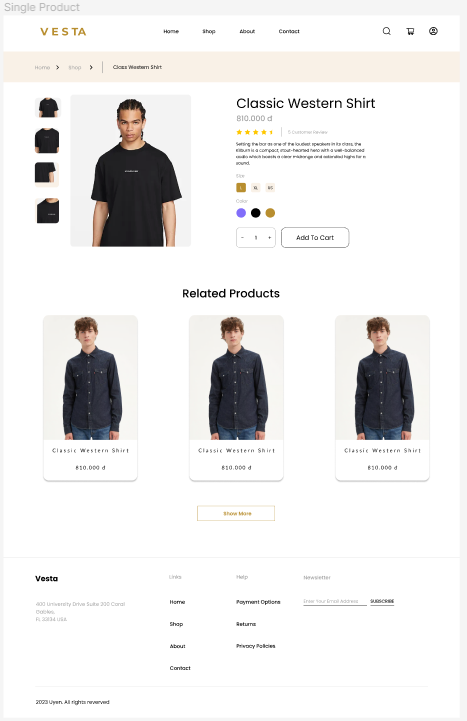
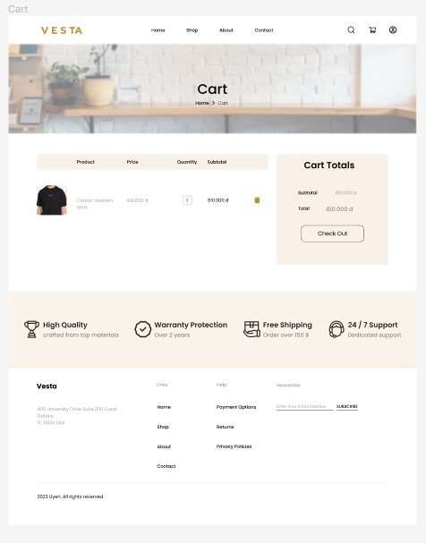
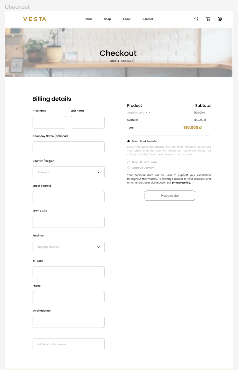
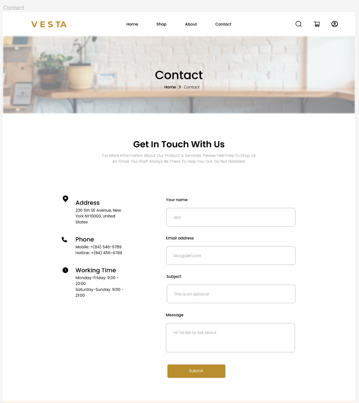
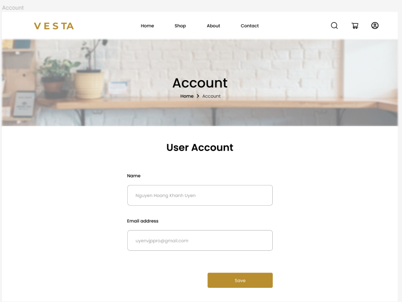
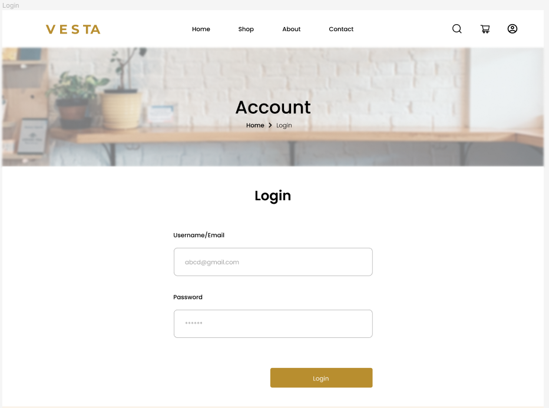
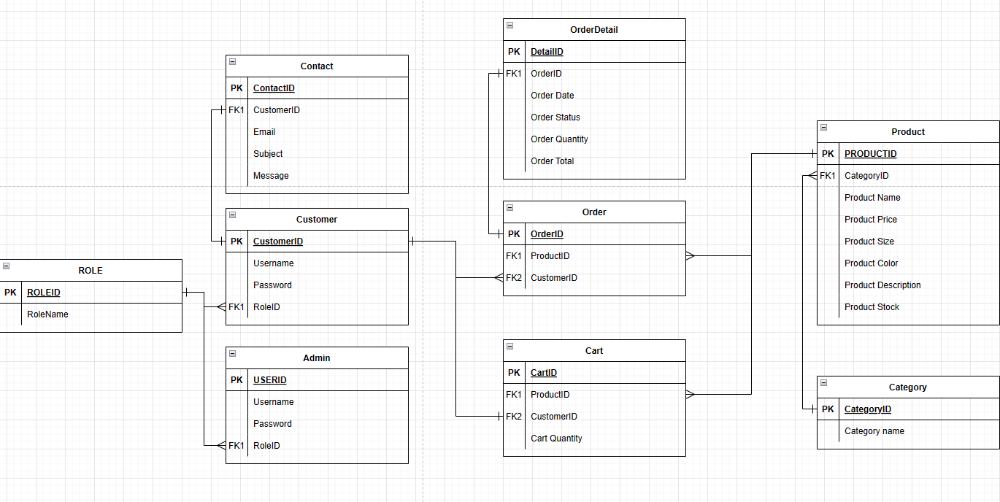

# Vesta - Clothing Store Specification
## Made by Lê Anh Quân, Nguyễn Hoàng Khánh Uyên, Nguyễn Phương Thanh

### Requirements
#### Purpose.
- Vesta helps users to buy clothes online quickly, anytime, anywhere.

- Easily find quality clothing products at affordable prices.

- Provide quality online shopping experience to users.

- Provide direct shipping to the customer’s address.

#### App Users

Customer:
- A customer is a user of the store that has an account with the store. They are able to access the customer side of the store and are able to login to their account. If they forget their password, they are able to reset it in the login page. Customers can purchase products from the store and choose their preferred ways of payment.

Staff:
- Staff are hired employee which includes the administrators that will help manage the store's products. They are able to login to their registered account to access the managing side of the store. Admins are able to add, update and delete products from the product catalog. Add catagories to catalog. Admin account cannot login to the customer side.

Guest:
- Guest are users who do not have an account with the store. They are free to browse the store and see its details, but cannot purchase any products. They can register an account with the store, with an account they will become a customer and be able to purchase products from the store.

#### Feature list

Login, Logout, Register
- Customers and admin will be able to login and logout of their accounts. Customers will only be able to access the customer side of the app, admin will only be able to access the managing side of the app. Guests can register anm account making them a customer.

Edit Cart
- Customers can edit the contents in their cart, allowing them to remove or edit the products in their cart before purchase.

View Order
- Customer can view their placed order in full detail of the information that they filled as well as the delivery date and total amount they paid.

Authentication
- Each account will have a role assigned to them to differentiate between admins and customers.

Filter / Sort / Search Product
- Main Shopping page has a sort/filter feature to help the customers find their preferred product.

Admin Account
- An account specifically made for hired staff and store owner. Made so that they can access the managing side of the app, which allows them to add, update and remove products and prodcut categories.

Reset Password
- Customers who has forgotten their account password can reset their password via the "Reset Password" link in the login screen.

Edit Profile
- Each customers has a profile, in which they can add and alter their information such as name, address, phone, etc.

Add, Update and Delete Product/Product Category
- The main feature for the managing side of the app, allows the admins and store owner to add, update and delete products as well as the product's category

### Wireframe
Home page of Vesta - Clothing Store.
- Has a recommend section
- A banner featuring latest deals
- Able to click on picture to go catalog with similar products

Main shopping page of Vesta
- Able to click on picture or name of product to go see details of product
- Able to hover over picture of product to see "Add to cart" prompt, which customer can click to add to their cart

Detailed view of product
- A picture carousel for the customer to better see the product
- Has name, rating, description of product.
- Able to choose size, color and amount of the product to add to cart
- Has 3 highlighted related products, is able to show more

The Customer's Cart
- Has a picture, name, price, quantity, color of product
- Has a calculated subtotal based on the quantity of each product
- Has a final total of all products in cart

The Checkout PAge
- Billing details allows customer to fill in necessary information for checkout
- Has a final total check
- Allows customer to choose way of payment

Contact Page
- Allows customer to send messages to the admins
- Has detailed physical contact information

Customer's Profile Page
- Allows customer to change their information

Reset Password Page
- Allows customer to reset their password

Login Page
- Allows customer to login to their account

### Database Design

### System Design

### Technical Summary

Users of the store
| User | Explanation |
|--|--|
|Customer| End user with an account. Able to add products to a cart and purchase with chosen payment method|
|Staff| Hired staff with access to the managing side of the app, allowing them to insert, update and delete products and catagory|
|Guest| Users that have yet to make an account, they are able to browse freely. Can register an account with the store|

Feture list
|Feature | Explanation|
|--|--|
| View Product | Allows customers to view products in home screen or product catalog |
| Edit Cart | Allows customers to add items, remove items, and update each item in cart|
| View Order | Allows customers to view their orders|
| Authentication | Web app will differentiate customers from registered admins |
| Filter / Sort / Search Product | Allows customers to search or filter to see their preferred products |
| Login | Allows customers to login to be able to purchase products |
| Admin Account | Allows admins to manage the web app |
| Logout | Allows customer to logout of their account |
| Register | Allows guests to register an account |
| Reset Password | Allows customers to reset their passwords if they forget them |
| Edit Profile | Allows customers to add and update information inside their profile |
| Add, Update and Delete Product/Product Category| Allows admins to add, update or remove products |

### Conclusion and Discussion
The shortened work time of this assignment hurts, our team has yet to implement even half of the proposed features in this document.
As the person who is wiritng this document, this assignment taught me that this type of time crunch hurts my soul and body, and also it taught me that I need to increase my coding skills.
